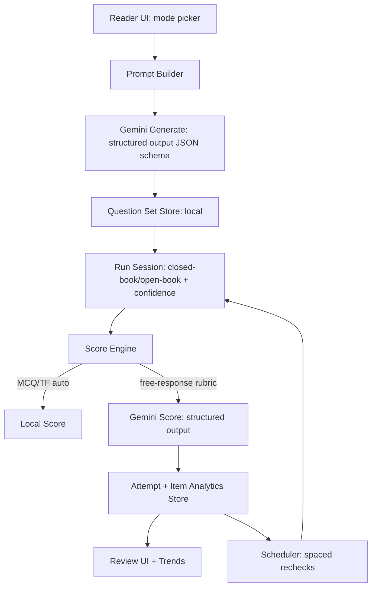
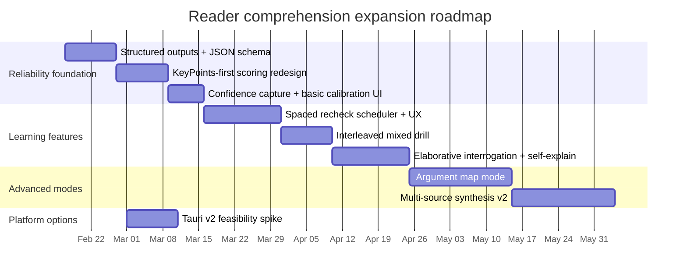

# Improving and Expanding Comprehension Check Modes in Reader

## Executive Summary

Reader’s current Comprehension Check system is already a meaningful step beyond “speed reading”: it uses LLM-generated questions, supports both a quick-check and a multi-source exam workflow, and persists attempt history locally for review. The current implementation also contains several thoughtful learning-aligned ideas—most notably a **closed-book → open-book** phase split and **free-response scoring with a rubric**—which strongly match decades of research showing that **retrieval practice** (testing) outperforms re-reading for durable retention. citeturn0search1turn0search3turn2search7

The largest opportunities are not “add more questions,” but to (a) expand the system into **multiple distinct comprehension modes** that align with (i) active-reading discipline (Adler/Van Doren) and (ii) empirically supported learning techniques (Brown/Roediger/McDaniel plus core cognitive-science literature), (b) harden LLM reliability using **structured outputs + calibration and adversarial tests**, and (c) evolve from “single-session check” toward **spaced retrieval** and **interleaving** across time and across sources. citeturn0search0turn0search1turn5search0turn5search6turn2search0turn2search6

Key recommendations:

Reader should support a **small portfolio** of comprehension modes—each with a distinct learning purpose and UX contract—rather than treating all question types as variants of one “quiz.”

- **Retrieval-first modes:** short-answer / free recall checks optimized for delayed retention and transfer. citeturn0search1turn5search8turn9search0turn9search47  
- **Elaboration modes:** “why/how” prompts (elaborative interrogation) and “explain your reasoning” (self-explanation), which are recommended in major reviews and supported by classic studies. citeturn0search3turn5search11turn5search9turn5search10  
- **Synthesis modes:** structured “compare/contrast across sources” tasks aligned with syntopical reading goals and with exam-style transfer. citeturn5search8turn2search1turn2search2  
- **Spaced retrieval modes:** scheduled re-checks and cumulative reviews implementing spacing effects and reducing the “illusion of competence.” citeturn0search0turn0search1turn1search0turn9search3  
- **Interleaved practice modes:** mixed-topic / mixed-format sessions that improve discrimination and transfer. citeturn5search0turn5search6turn5search18  
- **Confidence calibration modes:** explicit confidence judgments and calibration feedback to combat miscalibrated self-assessment; support “I don’t know / withhold” to trade quantity for accuracy. citeturn9search3turn9search14turn0search1turn1search1  

On the LLM side, the most impactful change is to move from “JSON-ish prompting” to **Gemini structured outputs using JSON Schema**, which is explicitly supported and reduces parse failures and prompt fragility. citeturn2search0turn2search6

On the platform side, since this is a local-first desktop tool and you’re open to alternatives to Electron, the most pragmatic “keep the React UI, improve footprint and security posture” path is usually **Tauri v2**, which has a capability/permissions system and Rust-side HTTP plugins that can keep API keys out of the renderer and reduce exposure if the UI is compromised. citeturn7search1turn7search5turn6search1turn6search19

Unspecified items that affect design choices (explicitly acknowledged):

- Target user demographics (students vs professionals vs researchers; external certification needs vs self-study).  
- Platform constraints (Windows-only vs macOS/Linux; accessibility expectations; distribution channel). citeturn8search3turn8search6turn8search0turn8search3  
- Performance budgets (latency tolerance for generation/scoring; token/cost ceilings; offline requirements).  
These should become configuration inputs (defaults + “power user” overrides) rather than hard-coded assumptions.

## Current Repo State for Comprehension Checks

### What exists today

From repository inspection (cmfunderburk/Reader, current mainline as accessed via the GitHub connector), the comprehension subsystem currently provides:

- A **quick-check flow** (single-article) and an **exam flow** (multi-source, preset length, optional open-book synthesis).
- A **closed-book vs open-book** split: recall-oriented questions first, then interpretation/inference/evaluation with the text available.
- Mixed formats: multiple-choice, true/false with explanation, short-answer, and essay.
- Per-question scoring on a 0–3 rubric; free-response is scored by Gemini; multiple-choice is auto-scored.
- Attempt persistence in local storage and an in-app review UI with adjustable review depth.

This architecture already reflects a crucial learning-science point: retrieval is a learning event, not just an assessment. citeturn0search1turn1search0turn2search7

### Data models as they relate to comprehension

The current data model (again, based on repo inspection) centers on:

- Question generation output (prompt/options/correct answers/model answer).
- Question result (user answer, model feedback, numeric score).
- Attempt object storing metadata (article, mode, timestamps, overall score, duration).

Notably absent (high-leverage gaps):

- **Confidence judgments** and calibration data (predicted score, confidence per answer). citeturn9search3turn1search1  
- **Retrieval schedule** (next due date, spacing interval, stability). citeturn0search0turn0search7  
- **Hint usage** / scaffolding level used (important for modeling mastery vs support).  
- **Item analytics** (difficulty, discrimination, stability, lures that cause systematic errors). citeturn9search9turn9search4  
- **Source coverage and cross-source linking** beyond the exam builder’s selection list (critical for syntopical/synthesis modes).

### Current UX flows

Reader currently positions comprehension checks in two main UX contexts:

- “Immediate follow-up” after finishing a reading session (good for reinforcing encoding). citeturn0search1  
- “Intentional assessment” launched from a builder (good for deliberate practice and interleaving across sources). citeturn5search0turn5search6  

This is directionally correct, but the UX does not yet operationalize the best-supported long-term retention interventions:

- **Spaced re-checks after delay** (days/weeks), which are repeatedly supported across large literatures and meta-analyses. citeturn0search0turn0search7  
- **Interleaving across topics/problem types** to improve discrimination and transfer. citeturn5search0turn5search6turn5search18  
- Calibration loops to reduce “illusion of knowing,” especially when users rely on recognition (MCQ) rather than production (free response). citeturn0search1turn9search47turn9search3  

## Principles to Anchor the Next Comprehension Modes

### Mapping active reading to “what to test”

Adler/Van Doren’s core practical contribution (as reflected in publisher materials and standard descriptions) is that reading comprehension is not passive; it involves progressing through levels and actively extracting structure, claims, and meaning. The Simon & Schuster publisher page emphasizes levels of reading (elementary → inspectional → analytical, and “syntopical” across multiple books) and active critical extraction of an author’s message. citeturn2search1turn2search2

For Reader, the important translation is:

- Don’t assess only “facts remembered.”  
- Assess whether the reader can:  
  - state the **main claim/thesis**,  
  - reproduce the **argument structure**,  
  - identify key terms/definitions,  
  - connect ideas across chapters/sources (syntopical), and  
  - critique/evaluate the argument.

These become mode definitions, not just question “dimensions.”

### Learning science: which techniques consistently improve durable learning

Across primary research and high-quality reviews, several learning techniques show robust benefits:

- **Practice testing / retrieval practice** improves long-term retention relative to restudy, even for prose passages. citeturn0search1turn5search8  
- **Spacing (distributed practice)** yields better long-term recall than massing; meta-analytic work shows dependencies between spacing interval and retention interval. citeturn0search0turn0search7  
- **Interleaving** can improve later performance even when it hurts performance during practice, likely because it forces discrimination and strategy selection rather than repetition. citeturn5search0turn5search6turn5search18  
- **Elaborative interrogation** (“why would this be true?”) helps learning by prompting links to prior knowledge; effectiveness depends on knowledge base and scaffolding. citeturn5search11turn0search3turn3search15  
- **Self-explanation** supports deeper learning when learners generate explanations that connect steps to underlying principles. citeturn5search9turn5search10turn5search4  
- **Feedback design matters**: MCQ can introduce misinformation via lures, and feedback can reduce negative effects and strengthen retention. citeturn9search9turn9search4turn9search13  

A particularly relevant nuance for Reader’s format decisions:

- Short-answer / production tests often lead to larger delayed benefits than recognition formats (MCQ), including in simulated classroom settings. citeturn9search47turn9search0turn5search12  
- But MCQ can be effective for retention and comprehension, and recent work suggests MCQ practice can outperform true/false in some settings. citeturn9search13turn9search9  
This implies Reader should deliberately choose formats by learning objective, cost, and user friction—not default to one “best” type.

## Comprehension Modes to Implement

### Comparison table of proposed modes

The table below treats each mode as a product surface with a learning purpose, required data, and implementation path.

| Mode | Primary learning mechanism | Best for | Typical formats | Scoring approach | UX complexity | Implementation complexity |
|---|---|---|---|---|---|---|
| Retrieval Check | Retrieval practice citeturn0search1 | Durable recall of key ideas | Short-answer, free recall, cloze | Rubric + anchored key points | Medium | Medium |
| Elaborative Interrogation | “Why/how” elaboration citeturn5search11turn0search3 | Meaning-making, causal understanding | Short-answer, two-stage prompts | Rubric + concept links | Medium | Medium |
| Self-Explanation | Explain reasoning/principles citeturn5search9turn5search10 | Deep structure + transfer | Explain-a-step, “teach-back” | Rubric + step coverage | Medium | Medium–High |
| Argument Map | Structural comprehension (analytical reading) citeturn2search2 | Tracking claims/evidence | Outline, claim→evidence mapping | Hybrid: deterministic + LLM | High | High |
| Synthesis Across Sources | Syntopical / transfer citeturn2search1turn5search8 | Multi-article integration | Compare/contrast essays, short synthesis | Rubric + cross-source constraints | High | High |
| Spaced Recheck | Spacing + retrieval citeturn0search0turn0search7 | Long-term retention | Micro-quizzes, 1–3 items | Auto + rubric | Medium | High (scheduler + data) |
| Interleaved Mixed Drill | Interleaving/discrimination citeturn5search0turn5search6 | Discriminating similar concepts | Mixed sets across articles | Same as above | Medium | Medium–High |
| Confidence Calibration | Metacognitive monitoring/control citeturn9search3turn9search14 | Reducing overconfidence; better self-regulation | Confidence ratings + “withhold/I don’t know” | Calibration metrics | Medium | Medium |

### Mode specifications, Gemini prompts, example I/O, and rubrics

Below are concrete prompt templates designed for Gemini. The critical change versus many LLM quiz implementations is: **use structured output with a schema** rather than trusting raw JSON-in-text. Gemini explicitly supports JSON Schema / structured outputs. citeturn2search0turn2search6

#### Shared design conventions for all prompts

- Always pass **(a) excerpt(s), (b) question blueprint, (c) output schema**.
- Prefer **short, checkable “key points”** for scoring (reduces hallucinated rubrics).
- Use a **two-pass approach** for important items:
  1) generate questions + key points;  
  2) score user responses against key points (not against a freeform “model answer”).  
- Avoid requiring chain-of-thought in outputs; request **brief rationales/checklists** if needed (kept internal in JSON fields).

##### Shared JSON Schema fragments

You can reuse these with Gemini structured outputs:

```json
{
  "type": "object",
  "properties": {
    "items": {
      "type": "array",
      "items": { "$ref": "#/$defs/Item" }
    }
  },
  "required": ["items"],
  "$defs": {
    "KeyPoint": {
      "type": "object",
      "properties": {
        "id": { "type": "string" },
        "text": { "type": "string" },
        "weight": { "type": "integer" }
      },
      "required": ["id", "text", "weight"]
    },
    "Item": {
      "type": "object",
      "properties": {
        "id": { "type": "string" },
        "mode": { "type": "string" },
        "prompt": { "type": "string" },
        "format": { "type": "string" },
        "options": { "type": ["array", "null"], "items": { "type": "string" } },
        "correctOptionIndex": { "type": ["integer", "null"] },
        "keyPoints": { "type": ["array", "null"], "items": { "$ref": "#/$defs/KeyPoint" } },
        "referenceAnswer": { "type": "string" },
        "difficulty": { "type": "string" }
      },
      "required": ["id", "mode", "prompt", "format", "referenceAnswer", "difficulty"]
    }
  }
}
```

---

#### Retrieval Check mode

**Goal:** make retrieval the default “learning event,” not re-reading. This aligns directly with the testing effect literature. citeturn0search1turn5search8

**Generation prompt (Gemini):**

```text
You are generating a Retrieval Check for a reader who just finished studying the excerpt below.

Rules:
- Write questions that require recall of meaning, not quoting sentences.
- Prefer short-answer prompts. Include at most 1 multiple-choice item.
- For each item, provide 3–6 key points (atomic facts/ideas) to score against.
- Difficulty: {difficultyTarget} (standard | challenging).

Excerpt:
<<<
{excerpt}
>>>

Output:
Return JSON that matches the provided schema exactly.
```

**Example output (abbrev):**

```json
{
  "items": [
    {
      "id": "rc-1",
      "mode": "retrieval_check",
      "prompt": "What is the author’s main claim in this excerpt? Answer in 1–2 sentences.",
      "format": "short_answer",
      "keyPoints": [
        {"id":"kp1","text":"States the central thesis accurately","weight":2},
        {"id":"kp2","text":"Avoids minor details or examples","weight":1},
        {"id":"kp3","text":"Uses domain terms correctly","weight":1}
      ],
      "referenceAnswer": "The author argues that ...",
      "difficulty": "standard"
    }
  ]
}
```

**Scoring rubric (0–3):**

- 3: hits all high-weight key points; no major misconception.
- 2: hits central claim but misses ≥1 key supporting condition or adds a minor misconception.
- 1: partially relevant but mostly vague / confuses thesis with detail.
- 0: unrelated, empty, or contradicts excerpt.

**Confidence calibration (optional for this mode):** ask user for confidence 1–5; store it for calibration charts.

---

#### Elaborative Interrogation mode

**Goal:** deepen meaning by asking “why/how would this be true?”—supported in major reviews and specific EI research. citeturn0search3turn5search11turn3search15

**Generation prompt:**

```text
Create an Elaborative Interrogation set.

Rules:
- Each prompt must be a WHY/HOW question that forces linking to prior knowledge or causal reasoning.
- Require the user to cite 1 piece of evidence from the excerpt (paraphrase OK).
- Provide key points that include at least: (a) a correct causal link, (b) an evidence reference, (c) a boundary condition / limitation.

Excerpt:
<<<
{excerpt}
>>>

Return JSON matching schema.
```

**Example prompt item:**

- “Why does the author believe X leads to Y? Give (1) the mechanism, (2) one excerpt-based support, (3) one limitation.”

**Scoring emphasis:** correctness of mechanism and evidence linkage (not eloquence).

---

#### Self-Explanation mode

**Goal:** force the reader to explain steps or principles in their own words, consistent with classic self-explanation findings. citeturn5search9turn5search10turn5search4

**Generation prompt:**

```text
Create a Self-Explanation exercise.

Rules:
- Pick 2–4 “hinge” sentences/ideas from the excerpt (conceptual pivots).
- For each, ask the user to explain: what it means, why it matters, and how it connects to the main claim.
- Provide key points emphasizing principle-connection (not paraphrase).
- Include a common misconception to watch for in scoring notes.

Excerpt:
<<<
{excerpt}
>>>

Return JSON (schema).
```

**Scoring rubric nuance:** reward principle-based explanation; penalize pure paraphrase.

---

#### Argument Map mode

**Goal:** operationalize “analytical reading” by extracting structure: claims → reasons → evidence → assumptions → counterpoints. This matches Adler/Van Doren’s emphasis on x-raying a book and reading critically. citeturn2search2turn2search1

**Generation prompt:**

```text
Create an Argument Map task.

Rules:
- Ask the user to produce a structured map with:
  1) Main claim
  2) 2–4 supporting reasons
  3) Evidence/examples for each reason
  4) 1 key assumption
  5) 1 plausible counterargument
- Provide a reference map in compact form.
- Provide a scoring checklist with weighted components.

Excerpt:
<<<
{excerpt}
>>>

Return JSON with:
- prompt
- referenceAnswer (structured text)
- keyPoints (each a checklist element with weights)
```

**Implementation recommendation:** give users a UI template (editable fields) rather than a blank text box; this reduces friction and makes scoring more reliable.

---

#### Synthesis Across Sources mode

**Goal:** enforce cross-source integration (syntopical reading) and transfer; testing supports transfer beyond repeated studying. citeturn5search8turn2search1turn2search2

**Generation prompt (multi-source):**

```text
Create a Synthesis task using multiple excerpts.

Rules:
- The prompt must REQUIRE using at least 2 sources.
- The user must: (a) identify agreement, (b) identify disagreement, (c) propose a reconciliation or boundary condition.
- Provide key points labeled by sourceId so scoring can verify cross-source coverage.

Sources:
{for each source}
[SourceId: {id}]
Title: {title}
Excerpt:
<<<
{excerpt}
>>>

Return JSON (schema). Include source coverage requirements.
```

**Scoring:** include explicit penalties for “single-source” answers.

---

#### Spaced Recheck mode

**Goal:** turn comprehension checking into durable memory formation via spacing and repeated retrieval. Meta-analytic work and classic research support spacing effects, with optimal spacing depending on desired retention interval. citeturn0search0turn0search7

**Mode definition:**

- After an attempt, schedule 1–3 micro-items due at +1 day, +4 days, +14 days (configurable).
- Use **very small** prompts:
  - “State the main claim.”
  - “Define term X.”
  - “Give one implication / example.”

**LLM generation prompt for spaced micro-items:**

```text
Generate 3 spaced-retrieval micro-prompts.

Rules:
- Each must be answerable in <= 30 seconds.
- Each must target a different high-value idea.
- Include key points for scoring.
- Avoid multiple-choice unless the user previously struggled severely.

Excerpt:
<<<
{excerpt}
>>>

Return JSON.
```

**Why it matters:** repeated retrieval improves retention; spacing improves long-term durability; equal vs expanding schedules depend on goals. citeturn0search1turn0search0turn0search7

---

#### Interleaved Mixed Drill mode

**Goal:** interleaving can improve later performance even when practice feels harder; it improves discrimination/strategy selection. citeturn5search0turn5search6turn5search18

**Mode definition:**

- Mix micro-prompts from multiple recent articles or from a curated “topic set.”
- Ensure no two consecutive items are from the same source and the same prompt type.

**Generation prompt:**

```text
Create an Interleaved Mixed Drill set from these source summaries.

Rules:
- 8–12 items.
- No two consecutive items from the same sourceId.
- Mix retrieval, elaboration, and a single synthesis item.
- Provide key points for each.

Sources:
{source list with id + brief excerpt}
Return JSON.
```

---

#### Confidence Calibration mode

**Goal:** make self-assessment measurable; reduce overconfidence and improve regulation.

- Roediger & Karpicke show that repeated studying can inflate confidence while producing worse delayed recall than testing. citeturn0search1  
- Metacognition research models how monitoring and control can improve accuracy when people can withhold uncertain answers. citeturn9search14turn9search3  

**UX mechanics:**

- Before revealing feedback, ask:
  - Confidence 1–5
  - “Would you submit, or mark ‘not sure’?” (optional)
- After feedback:
  - Show calibration delta (predicted vs actual)

**Scoring integration:**

- Compute per-user calibration curve and a simple Brier-style score for confidence vs correctness (especially for MCQ items).

## LLM Prompting Strategies for Gemini

### Use structured outputs and schemas as the default reliability layer

Gemini explicitly supports structured outputs with JSON Schema, and documentation highlights predictable parsing and programmatic detection of refusals. citeturn2search0turn2search6

Implementationally, this should replace prompt patterns that rely on “Return JSON only” and brittle fence parsing. The immediate payoffs:

- fewer malformed payload retries,
- easier migrations when fields change,
- more robust validation and analytics.

### Rubric-based scoring grounded in key points

A major failure mode in LLM grading is “grading against its own narrative,” which can drift. Grounding scoring to **key points extracted from the excerpt** reduces hallucinated criteria.

Pattern:

1) Generate item with keyPoints[] (small, checkable).  
2) Score userAnswer against keyPoints with explicit constraints:
   - “Only use excerpt information.”
   - “If contradiction, score 0.”
   - “Return score + feedback + which keyPoints were met.”

### Few-shot prompting as “policy examples,” not content examples

Use few-shot examples that teach the model:

- desired strictness,
- how to handle partial answers,
- how to grade confidently vs uncertainly.

Avoid few-shot examples that are too content-specific (they can leak style and bias the model).

### Calibration and adversarial testing harness

Because scoring is a core trust surface, implement:

- **golden test suite**: fixed excerpt + fixed user answers + expected scores (unit tests).
- **adversarial suite**: tricky cases:
  - plausible but wrong paraphrase,
  - unsupported claims,
  - quoting without meaning,
  - verbosity without substance,
  - “I don’t know” answers.

This is especially important because MCQ and true/false can create misinformation effects unless feedback is handled well. citeturn9search9turn9search4turn9search13

### Key management in Gemini requests

Google’s Gemini API documentation shows API keys passed via headers such as `x-goog-api-key`, supporting a safer alternative to putting keys in the URL. citeturn0search6  
Separately, OWASP guidance emphasizes careful handling of API keys and not treating them as sufficient protection for high-value resources. citeturn6search18

## UX Improvements and Evaluation Plan

### UX improvements that directly follow from the evidence

The learning-science findings imply specific UX choices:

- Prefer **production** (short-answer) when the goal is durable retention, even if MCQ feels easier. citeturn9search47turn9search0turn0search1  
- Use MCQ strategically:
  - for low-friction warm-up,
  - for discrimination practice under interleaving,
  - but include feedback to mitigate lure/misinformation effects. citeturn9search9turn9search4turn9search13  
- Make “closed-book” the default, but allow **scaffold escalation**:
  1) no hints,  
  2) hint (key terms only),  
  3) hint (1–2 key points),  
  4) open-book excerpt reveal.  

### Concrete UX features to add

- **Timing controls per mode:** “30s micro-check,” “5-min drill,” “exam.”  
- **Immediate vs delayed feedback toggle:** allow delayed feedback for a subset of sessions; feedback timing effects differ by context, and recent work continues to study these tradeoffs. citeturn9search4turn5search14  
- **Hint / reveal tracking:** any hint used should be recorded, so a “correct with heavy support” does not look like mastery.  
- **Difficulty adaptation:** use rolling item scores + confidence to choose next difficulty (desirable difficulty principle in practice). citeturn2search7turn1search0  
- **Analytics views (local-first):**
  - retention over time (score vs days since read),
  - calibration chart (confidence vs accuracy),
  - weakest modes/dimensions,
  - “items that won’t stick” list (repeated misses).

### Evaluation plan

A rigorous plan can be local-first (no server required), while still enabling randomized experiments.

**Metrics (learning + behavior):**

- Completion rate, mean time-to-complete, dropout points.
- Immediate performance vs delayed performance (spaced rechecks).
- Persistence of learning: score at +1d / +7d / +30d. citeturn0search0turn0search7  
- Transfer: new questions that require inference/application, not repeats. citeturn5search8  
- Calibration: confidence–accuracy correlation and calibration error. citeturn9search3turn9search14  

**Experiments:**

- A/B: “MCQ-heavy quick check” vs “short-answer heavy quick check,” measuring delayed retention and user friction. citeturn9search47turn9search13  
- A/B: “immediate feedback” vs “end-of-session feedback,” measuring retention and satisfaction. citeturn9search4turn5search14  
- A/B: spaced scheduling variants (+1/+4/+14 vs +2/+7/+21), measuring retention and completion. citeturn0search0turn0search7  
- Interleaving vs blocked sessions for a topic set, measuring later discrimination. citeturn5search0turn5search6  

**User study protocol (small-N, high signal):**

- Think-aloud with 6–10 users: identify friction, clarity of feedback, and perceived usefulness.
- Diary study (2–4 weeks): do spaced rechecks occur, and do users perceive improved recall?

## Implementation Roadmap, Data Model Changes, Privacy, and Packaging Options

### System flow diagram



### Data model and API changes

Add the minimum fields needed to support spacing, interleaving, hinting, and calibration.

Proposed additions (conceptual):

- **Question item**
  - `mode` (retrieval_check | elaboration | self_explanation | argument_map | synthesis | spaced_recheck | interleaved_drill)
  - `keyPoints[]` (weighted)
  - `targetLatencySec` (micro vs deep)
  - `sourceRefs[]` (for multi-source validation)
- **User response**
  - `confidence` (1–5)
  - `withheld` (boolean) or `answerPolicy` (submit | unsure | skip)
  - `hintsUsed[]` (enum)
  - `timeToAnswerMs`
- **Scheduling**
  - `nextDueAt`, `lastSeenAt`, `intervalDays`, `stability` (heuristic)
  - `lapseCount`

### Privacy and security considerations

Because Reader is local-first, privacy posture can be excellent—*if* the LLM boundary is clear.

Core issues and mitigations:

- **Do not put API keys in URLs or query strings.** URLs are frequently logged; better practice is headers. citeturn6search2turn6search4turn0search6  
- If staying on Electron, follow Electron’s security checklist (context isolation, sandboxing, cautious IPC). citeturn6search1turn6search19  
- Provide explicit controls:
  - “Send full text” vs “Send excerpt only”
  - “Redact numbers/emails/URLs before sending”
  - “Offline-only mode” (disables comprehension checks that require Gemini)

### Packaging options beyond Electron

You indicated openness to moving away from Electron. The best option depends on whether you want to **reuse the existing React/TS UI** or rewrite.

**Keep UI, change shell (lowest rewrite):**

- **Tauri v2:** keep React UI; move Gemini calls + key storage to Rust backend commands; use capability restrictions to reduce exposure. Tauri’s capability system is explicitly designed to granularly enable/deny permissions per window/webview. citeturn7search1turn7search5  
  - Pros: smaller footprint; stronger default separation; easier to keep API keys out of renderer.  
  - Cons: Rust learning curve; plugin ecosystem differences.

**Rewrite UI (highest rewrite, potentially best long-run if you want “native-first”):**

- **Flutter (desktop):** official docs support compiling native Windows/macOS/Linux desktop apps. citeturn8search3turn8search6  
- **.NET MAUI:** official support for native cross-platform desktop + mobile in one codebase. citeturn8search0turn8search1  
- **Avalonia (.NET):** cross-platform rendering engine for consistent UI across platforms. citeturn8search2turn8search4  

For Reader specifically, if your primary goal is local-first study workflows and you want to preserve the current front-end investment, **Tauri v2 is typically the “best alternative to Electron”** to evaluate first.

### Prioritized task list with effort estimates

Effort estimates assume one experienced engineer familiar with the repo and TypeScript/React; they exclude “unknowns” like large UI redesign or long user studies.

| Priority | Task | Deliverable | Est. effort |
|---|---|---|---|
| P0 | Migrate Gemini calls to structured outputs | JSON Schema-based generation + scoring; fewer malformed responses citeturn2search0turn2search6 | 2–4 days |
| P0 | Add keyPoints-first scoring | Key-point extraction + scoring prompt redesign | 2–5 days |
| P0 | Add confidence capture + calibration view | Confidence per item + basic chart | 2–4 days |
| P1 | Implement Spaced Recheck scheduler | Due items, reminders/badge, recheck flow citeturn0search0turn0search7 | 5–10 days |
| P1 | Implement Interleaved Mixed Drill builder | Mixed sets across sources, anti-blocking rules citeturn5search0turn5search6 | 4–8 days |
| P1 | Expand mode portfolio (EI + Self-Explanation) | New prompts, UI scaffolds, rubrics citeturn5search11turn5search9 | 6–12 days |
| P2 | Argument Map mode | Structured UI + hybrid scoring | 8–15 days |
| P2 | Synthesis Across Sources v2 | Source-coverage constraints + rubric | 8–15 days |
| P0–P2 | Security hardening for API keys | Header-based auth; renderer isolation; local controls citeturn0search6turn6search1turn6search2 | 2–6 days |
| Optional | Evaluate Tauri v2 spike | “Hello Reader” shell + 1 Gemini call via Rust plugin citeturn7search1turn7search5 | 4–8 days |

### Timeline diagram



## Closing Synthesis

Reader already has a credible “comprehension pressure” system and a practical exam generator. The next step is to transform Comprehension Check from a single-feature quiz into a **learning system** that combines:

- retrieval practice (default, production-heavy), citeturn0search1turn9search47  
- spaced retrieval over time, citeturn0search0turn0search7  
- interleaving across topics and sources, citeturn5search0turn5search6turn5search18  
- elaboration + self-explanation, citeturn5search11turn5search9turn0search3  
- structured synthesis aligned with active-reading discipline, citeturn2search1turn2search2  
- and measured calibration to fight illusions of knowing. citeturn0search1turn9search3turn9search14  

Technically, the two “high leverage” foundations are (1) **Gemini structured outputs** and (2) **a richer data model** that tracks confidence, hints, and scheduling. Platform-wise, if you want a more secure and lighter-weight desktop shell without rewriting the UI, a **Tauri v2** spike is the most direct alternative to Electron worth evaluating early. citeturn2search0turn7search1turn7search5turn6search1