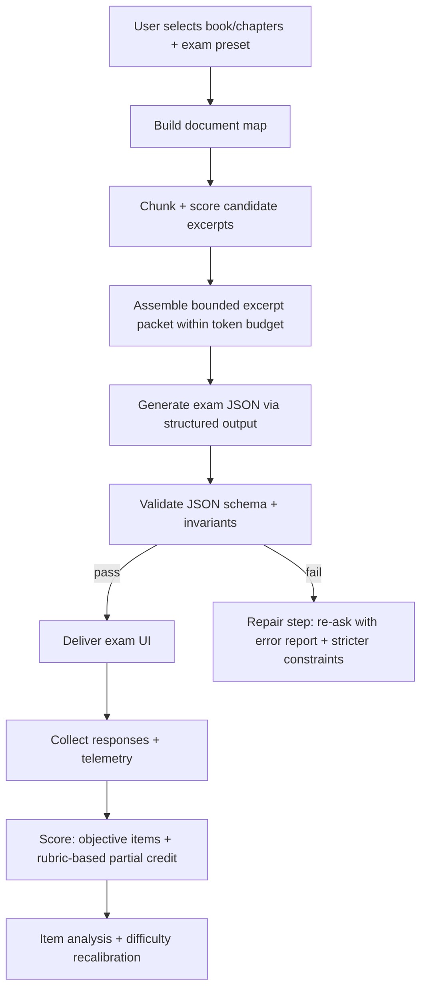
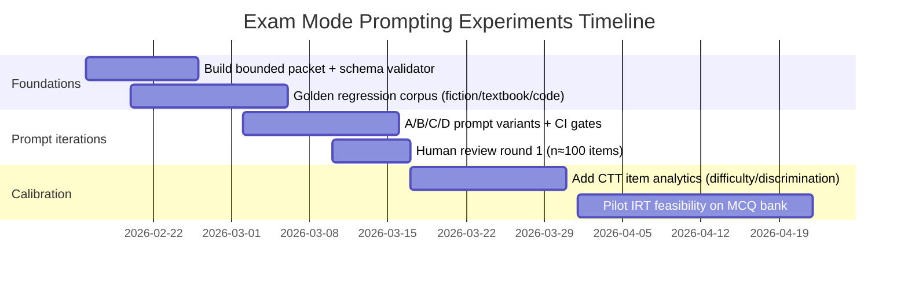
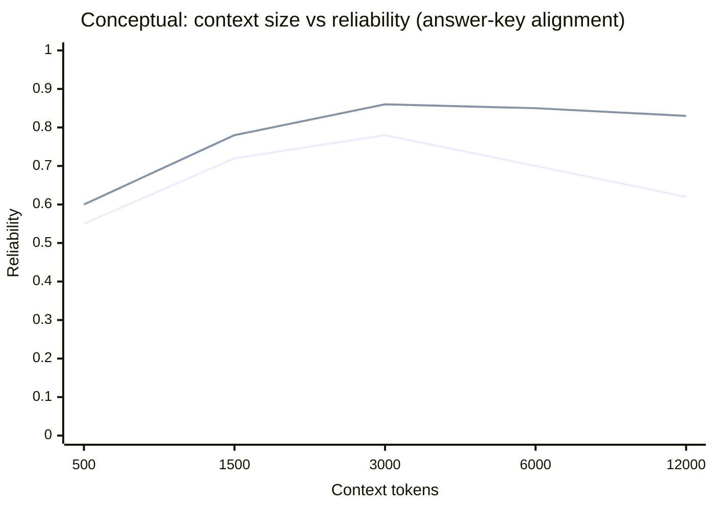

# Implementing a Reliable Exam Mode for the Reader App

> Document role: Reference and rationale document. This report informs design and post-V2 backlog options, but it is not the release scope contract for Exam Mode V2. V2 scope is defined by `docs/brainstorming/comprehension-exam-mode-v2-plan.md` and `docs/brainstorming/reader-exam-mode-v2-guide.md`.

## Executive summary

The current Reader app already contains a “Comprehension Check” workflow that generates mixed-format, passage-grounded question sets, persists attempt history locally, and uses a “closed-book → open-book” sequencing design. fileciteturn6file4 This is a strong foundation for an “exam-style mode,” but scaling from single-passage checks to **reliable, repeatable exams over variable-length content** (short fiction excerpts → long textbook chapters) raises three hard engineering problems: (i) **content selection and chunking** that preserves coverage while staying within token budgets, (ii) **difficulty calibration and scoring** that remains consistent across domains and item types, and (iii) **evaluation/QA infrastructure** to catch regressions in question quality, answer-key alignment, and format correctness.

A practical way to achieve reliability in v1/v2 is to treat the LLM as a *structured item writer* operating on a **bounded excerpt packet** (selected passages + lightweight metadata), and to enforce output constraints using **structured output (JSON schema)** rather than relying on post-hoc parsing. Google’s Gemini API supports schema-constrained JSON outputs via `responseMimeType: application/json` and `responseSchema` / JSON schema fields, which directly aligns with the “consistent output formats (JSON)” requirement. citeturn2search0turn2search2

For long texts, “more context” is not monotonically better: long-context models often show a *U-shaped* sensitivity to where relevant evidence occurs (“primacy/recency” vs “lost in the middle”). citeturn0search0turn0search2 This strongly motivates exam-mode prompt designs that (a) keep per-question evidence near the top/bottom of the prompt, (b) use retrieval/reranking to push relevant chunks earlier, and (c) generate question items with explicit **evidence spans** to allow downstream validation.

On the measurement side, reliability over time is best treated like a testing program: start with Classical Test Theory (difficulty/discrimination) and graduate toward Item Response Theory (separate person ability vs item difficulty). ETS provides accessible introductions and emphasizes IRT’s operational value for calibrating item parameters and scoring at scale. citeturn9search5turn9search50turn9search1

Finally, “academic integrity” features should be framed as *deterrence and friction*, not guaranteed detection: published evidence indicates AI-text detectors are often unreliable in educational settings. citeturn13search9 Stronger levers are randomization (item banks + parameterized variants), controlled open-book/closed-book phases, and optional watermarking concepts (while noting watermarking has robustness/security caveats). citeturn10search10turn6file4


## What exists in Reader today and what it implies for exam mode

Reader’s README describes a **Comprehension Check** workflow with: launcher and post-reading entry points, a designed progression from closed-book factual questions to open-book inferential/evaluative questions, mixed formats (MCQ, true/false, short answer, essay), explanatory feedback, and locally persisted attempt history. fileciteturn6file4 This indicates the app already embraces key exam-mode UX primitives: a “test session,” per-item feedback, and attempt review/history.

The repository also contains dedicated comprehension infrastructure (adapter/prompt/types/storage) and internal guidance for quiz behavior and MCQ option writing. fileciteturn6file3turn6file1turn6file2turn6file5turn6file6 In particular, the quiz skill doc’s MCQ guidance (“labels should be short… descriptions must not do the cognitive work…”) is directly relevant to distractor quality. fileciteturn6file6

Two uploaded planning documents extend this into an explicit **exam-style mode** concept. They propose building an exam packet from selected chapters/sections and emphasize deterministic structure, coverage, and consistency goals rather than purely “creative” item generation. fileciteturn0file0turn0file1 (Several implementation details are specified there; anything not described should be treated as unspecified rather than assumed.)

Implication: the highest-leverage path is **not** to reinvent the assessment system, but to generalize the existing Comprehension Check into:
- a broader *content selection layer* (chapter- and corpus-scale), and  
- a more formal *exam specification and schema* (sections, timing, scoring, randomization, accommodations),  
while reusing the existing attempt storage, review UI patterns, and “closed-book → open-book” pedagogy. fileciteturn6file4turn0file0turn0file1


## Exam item types, difficulty calibration, scoring, and distractor generation

A robust exam mode should support at least these item families (your list), but with distinct generation and scoring constraints per type:

**MCQ, True/False, Cloze (selected response)** are amenable to hard answer keys and automated scoring; they benefit from distractor strategies and item analysis.

**Short answer and essay (constructed response)** require rubrics and (if automation is desired) rubric-based grading pipelines with audited reliability. LLM-based evaluators can correlate with human judgments in some settings, but bias and consistency issues are well documented; careful prompting and calibration is required. citeturn13search3turn13search6turn11search15

**Code problems** can be objectively scored with tests (unit tests), which is a major advantage over free-form essays; this aligns with how common programming benchmarks are structured (prompt + canonical solution + tests). citeturn6search7turn6search1

### Difficulty calibration: from heuristics to psychometrics

**Phase one (heuristic calibration):**  
Before you have enough user response data, difficulty must be *dialed* using proxies:
- cognitive level (recall → application → synthesis),
- number of reasoning hops,
- amount of context needed,
- distractor similarity to the key,
- “open-book” vs “closed-book” constraint.

This aligns with the question-generation literature’s emphasis on controllability over difficulty and item types as a major research focus. citeturn11search9turn11search0

**Phase two (CTT item analysis):**  
As attempt data accumulates, compute:
- item difficulty index *(p-value = proportion correct)*,
- discrimination (e.g., point-biserial correlation with total score),
- option analysis (distractor selection frequencies),
- reliability (internal consistency like Cronbach’s alpha, used cautiously). citeturn8search1turn8search4turn8search0

**Phase three (IRT calibration):**  
For scaling a “difficulty ladder” across diverse content, IRT’s separation of person ability and item parameters is the standard operational approach in large-scale testing programs. ETS’ introductory materials explicitly describe calibration and item parameters as the core advantage over purely classical methods. citeturn9search5turn9search50turn9search1

### Rubrics and scoring

Recommended rubric design is “analytic” rather than purely holistic for transparency and partial credit—especially in textbook/application and essay items. For automated grading experiments, use rubric-based form-filling prompts and treat LLM grading as *one rater* whose agreement must be measured (human-human and human-LLM). LLM-as-a-judge research suggests good agreement can be achievable but highlights known biases (position/verbosity/self-enhancement). citeturn13search8turn13search3turn11search8

### Distractor generation heuristics and algorithms

High-quality distractors must be simultaneously:
- **plausible** (semantically close to the key),
- **incorrect** (contradicted by the passage or by a defined rule),
- **diagnostic** (reflect common misconceptions or confusions).

The distractor-generation literature commonly separates *candidate generation* from *ranking/filtering* using semantic similarity, collocation, and expert-informed strategies. citeturn11search4turn1search1turn11search1

Concrete heuristics you can implement (and/or instruct the model to follow):

**Heuristic set for MCQ distractors (passage-grounded)**
- *Entity swap*: replace a correct entity with a same-type entity mentioned elsewhere (or a plausible near miss) while keeping the predicate intact.
- *Scope/quantifier error*: “always/never/some” swaps; “increases/decreases”; sign flips in causal claims.
- *Temporal/sequence perturbation*: reorder events or invert “before/after” when the passage contains a clear timeline.
- *Near-definition confusion*: choose a related concept in the same taxonomy level (hypernym/hyponym confusion).
- *Boundary condition trap* (textbook/math): distractors correspond to common algebraic mistakes (dropping a minus, using wrong formula, unit mismatch).

**Algorithmic pattern (two-pass generator-filter)**
1. **Generate** N candidate distractors using controlled variation rules (entity swap, quantifier, misconception template).
2. **Filter** by constraints:
   - Must not be entailed by the evidence span.
   - Must be “close” by embedding similarity to the key (for plausibility).
   - Must keep the same grammatical role/part-of-speech shape as the key.
3. **Rank** by expected confusion:
   - similarity(key, distractor) high,
   - similarity(distractor, other options) not too high (avoid duplicates),
   - contradiction with evidence detectable (NLI or rule-based check).

This “generate then validate” stance is consistent with broader AQG findings that evaluation/answerability is a bottleneck and needs explicit attention. citeturn11search15turn11search13turn11search0


## Content selection, context windows, and retrieval-augmented generation

### Why context management is the core reliability problem

Long-context prompting is fragile: performance can degrade dramatically depending on where relevant information appears inside long prompts, with a characteristic “lost in the middle” effect. citeturn0search0turn0search2 This matters for exam generation because:
- you want broad coverage (many parts of the text),
- but the model cannot reliably attend to everything equally,
- and a single “dump the chapter” prompt is likely to produce hallucinated or misattributed items.

### A practical approach: bounded excerpt packets

The exam-mode planning documents explicitly emphasize building a bounded packet from long texts rather than sending full chapters verbatim. fileciteturn0file0turn0file1 This aligns with a best-practice inference from long-context research: keep relevant evidence compact and positioned advantageously, rather than maximizing raw context length. citeturn0search0turn0search2

A robust packet structure (proposed) is:

- **Document map**: titles/sections, approximate reading-time or token counts.
- **Selected excerpts**: chunk IDs + text + minimal metadata (chapter, section, offset).
- **Optional summaries**: per-chapter 150–300 token summaries to preserve global coherence (if you can generate them without violating cost/latency constraints).

### Rules of thumb and formulas for how much source context to include

Let:
- `C` = model context window (tokens)
- `O` = max output tokens reserved for the exam JSON
- `I` = instruction + schema overhead tokens
- `B` = guard band (safety margin), typically 5–10% of `C` to avoid truncation

Then a safe context budget is:
- `ContextBudget = C - O - I - B`

Suggested defaults (proposed):
- `B = 0.07 * C`
- `I = 600–1200` tokens depending on schema complexity and examples
- `O = 1200–4000` tokens depending on exam length and rationale fields

**Chunk sizing rule:** aim for chunks of **200–450 tokens** each for prose; small enough to move around and cite, large enough to preserve local coherence. (If you use RAG, chunk sizes should match your retriever’s embedding sweet spot; start in this range and tune experimentally.)

**Coverage rule:** allocate context roughly proportional to the exam blueprint:
- If the exam includes `S` sections, allocate context budgets `b_s` to each section and keep each section’s evidence near the top of that section’s prompt region (to mitigate “lost in the middle”). citeturn0search0

### When to add retrieval-augmented generation

For v1/v2, a single-call bounded packet can be enough; however, RAG becomes important when:
- the user selects many chapters,
- the app needs “concept application” questions that require dispersed evidence,
- or you want per-item evidence selection to be dynamic.

RAG’s core idea—combining parametric generation with non-parametric retrieval—was formalized in the RAG paper by Lewis et al., which motivates retrieval as a way to provide updatable, attributable external text. citeturn12view0

A practical “Reader exam mode” inference: treat “retrieval” as two layers:
- **pre-prompt retrieval** (your code selects the excerpt packet deterministically), and/or
- **in-prompt retrieval** (the model is instructed to select evidence spans from the packet, then write items referencing those spans).

### Prompt flow (visual aid)



The “validate then repair” loop is recommended because AQG evaluation is a known bottleneck, and structured output alone does not guarantee semantic correctness. citeturn11search15turn2search2


## Prompt templates and modular prompt components

Gemini supports schema-constrained generation (JSON mode) by setting `responseMimeType: application/json` and providing a schema. citeturn2search0turn2search2 This should be the default in exam mode to ensure stable parsing and consistent UI rendering.

Below are three **sample prompt templates** (proposed), each designed as modular components:

- **Instruction**: role + objective
- **Context**: bounded packet with chunk IDs
- **Examples** (optional): few-shot patterns
- **Constraints**: grounding rules, difficulty mix, coverage requirements
- **Output format**: JSON schema fields and invariants
- **Token budget guidance**: explicit budget targets and truncation instructions

### Fiction passage comprehension template (proposed)

```text
SYSTEM / INSTRUCTION
You are an exam item writer for reading comprehension of fiction.
Create an exam that tests: (a) literal comprehension, (b) inference about motivation,
(c) theme/imagery, (d) narrative technique.
All questions MUST be answerable using ONLY the provided excerpts.

CONTEXT PACKET (bounded)
- Model context window: {C_TOKENS}
- Reserved output tokens: {O_TOKENS}
- Target context budget: {CONTEXT_BUDGET_TOKENS}
- Excerpts:
  [E1]{excerpt_text_1}[/E1]
  [E2]{excerpt_text_2}[/E2]
  ...
  [E{k}]{excerpt_text_k}[/E{k}]

EXAM SPEC
- Total time: {MINUTES} minutes
- Items:
  - 4 MCQ (2 easy, 2 medium)
  - 2 short answer (medium)
  - 1 essay (hard)
- Closed-book phase: MCQ + first short answer (do not quote excerpts)
- Open-book phase: remaining items (student may reference excerpt IDs)

CONSTRAINTS
- Every item must cite 1–2 evidence excerpt IDs (E#) that contain the support.
- For MCQ: exactly 4 options; exactly 1 correct.
- Distractors must be plausible but contradicted by the cited evidence.
- Avoid trivia (names-only); test meaning, causality, and interpretation.

OUTPUT FORMAT (JSON only)
Return JSON with:
{
  "metadata": {...},
  "items": [
    {
      "id": "Q1",
      "type": "mcq|short|essay",
      "difficulty": "easy|medium|hard",
      "closed_book": true|false,
      "prompt": "...",
      "options": [{"id":"A","text":"..."},...],        // MCQ only
      "answer_key": {"correct_option_id":"B"}         // MCQ only
      "expected_answer": "...",                        // short/essay
      "rubric": [{"criterion":"...","points":2,"notes":"..."}],
      "rationale": "...",
      "evidence": [{"excerpt_id":"E2","quote":"<=25 words"}]
    }
  ]
}

TOKEN BUDGET RULES
- If total excerpts exceed context budget, prioritize: (1) turning points, (2) character decisions,
(3) imagery/theme-heavy paragraphs.
- Keep any evidence quote <= 25 words.
```

### Textbook concept application template (proposed)

```text
SYSTEM / INSTRUCTION
You are an exam item writer for textbook learning.
Write questions that test transfer: apply concepts to new scenarios, not memorization.

CONTEXT PACKET (bounded)
- Model context window: {C_TOKENS}
- Reserved output tokens: {O_TOKENS}
- Target context budget: {CONTEXT_BUDGET_TOKENS}
- Concept glossary (if provided): {GLOSSARY}
- Excerpts:
  [S1]{section_excerpt_1}[/S1]
  ...
  [S{k}]{section_excerpt_k}[/S{k}]

EXAM SPEC
- Sections:
  A) Concepts & definitions (short answer, closed-book)
  B) Application vignettes (MCQ + short answer)
  C) Synthesis (1 essay or structured response)

DIFFICULTY CALIBRATION (explicit)
- Easy: direct application of one definition or one formula.
- Medium: requires choosing among 2–3 concepts and justifying choice.
- Hard: requires multi-step reasoning, tradeoffs, or designing an approach.

CONSTRAINTS
- Each question must include an "evidence_anchor" referencing S# excerpts.
- Application vignettes must introduce a novel scenario NOT present verbatim in excerpts.
- Provide a rubric with point allocations for each constructed-response item.

OUTPUT FORMAT (JSON only)
Same schema as fiction, plus (for application items):
"skills": ["identify concept", "apply", "analyze", "synthesize"],
"common_misconceptions": ["...","..."]  // used for distractor rationale
```

### Programming/code assessment template (proposed)

```text
SYSTEM / INSTRUCTION
You are an exam item writer for programming assessment.
Create items that can be graded objectively where possible.

CONTEXT PACKET (bounded)
- Model context window: {C_TOKENS}
- Reserved output tokens: {O_TOKENS}
- Target context budget: {CONTEXT_BUDGET_TOKENS}
- Reference material:
  [R1]{constraints/spec excerpt}[/R1]
  [R2]{API or style guide excerpt}[/R2]
  Optional starter code:
  [CODE_START]{starter_code}[/CODE_START]

EXAM SPEC
- 2 MCQ (language semantics, complexity, debugging)
- 2 short answer (explain bug / propose fix)
- 1 code problem scored by unit tests (write a function)

CONSTRAINTS
- Code problem must include:
  - function signature,
  - constraints,
  - at least 6 unit tests (edge cases included),
  - hidden tests description (not the exact inputs).
- Ensure tests are consistent with the prompt and do not contradict constraints.
- Provide expected time and difficulty.

OUTPUT FORMAT (JSON only)
Each code item:
{
  "id": "Q5",
  "type": "code",
  "prompt": "...",
  "language": "python|js|ts|...",
  "starter_code": "...",
  "public_tests": ["assert ...", ...],
  "hidden_test_strategy": "description only",
  "reference_solution": "...",               // optional; if included, store securely
  "rubric": [...]
}
```

These templates deliberately force **evidence anchoring** and explicit **difficulty labels**, aligning with AQG research emphasizing answerability/evaluation and with practical needs for automated QA checks. citeturn11search15turn11search13turn0search0


## Evaluation metrics, automated test suites, and an A/B experiment plan

### What to measure

A reliable exam mode needs both *generation correctness* metrics and *psychometric/learning* metrics.

**Generation correctness (automatable)**
- JSON schema validity (strict)
- required fields present
- option count correctness for MCQ
- each item includes evidence anchors
- evidence quotes comply with length limits (copyright + prompt hygiene)
- answer key compatibility (e.g., correct option ID exists)
- no duplicate questions / near-duplicates
- coverage: excerpts used across chapters/sections (not all from one excerpt)

**Semantic quality (partially automatable, partially human)**
- answerability given evidence (LLM-based or NLI-based check)
- distractor plausibility and incorrectness
- difficulty category alignment with rubric complexity

The AQG evaluation literature repeatedly notes that evaluation is a bottleneck and that metrics like BLEU/ROUGE are insufficient; newer approaches propose answerability-focused evaluation and LLM-based judging frameworks. citeturn11search15turn11search13turn13search3

**Psychometric metrics (requires user response data)**
- item difficulty and discrimination (CTT)
- reliability (Cronbach’s alpha, used with care and assumptions) citeturn8search1turn8search4
- later: IRT calibration where feasible citeturn9search5turn9search1

### Suggested automated evaluation scripts and unit tests (pseudocode)

```python
# PSEUDOCODE: exam_generation_quality.py

def validate_exam_json(exam):
    assert exam["metadata"]["version"] == "exam_v1"
    assert len(exam["items"]) >= 1

    ids = set()
    for item in exam["items"]:
        assert item["id"] not in ids
        ids.add(item["id"])

        assert item["type"] in {"mcq","short","essay","cloze","code","true_false"}
        assert item["difficulty"] in {"easy","medium","hard"}

        # Evidence anchoring is mandatory for grounding
        assert len(item.get("evidence", [])) >= 1
        for ev in item["evidence"]:
            assert ev["excerpt_id"].startswith(("E","S","R"))

        if item["type"] == "mcq":
            opts = item["options"]
            assert len(opts) == 4
            opt_ids = {o["id"] for o in opts}
            correct = item["answer_key"]["correct_option_id"]
            assert correct in opt_ids

            # Heuristic: forbid identical options
            texts = [o["text"].strip().lower() for o in opts]
            assert len(set(texts)) == 4

        if item["type"] in {"short","essay"}:
            assert "rubric" in item and len(item["rubric"]) >= 2
            assert "expected_answer" in item

        if item["type"] == "code":
            assert "public_tests" in item and len(item["public_tests"]) >= 6
            assert "starter_code" in item

def check_answer_key_alignment(exam, excerpt_lookup):
    # Optional: LLM/NLI check that correct answer is entailed by evidence
    # and distractors are contradicted or not entailed.
    for item in exam["items"]:
        evidence_text = "\n".join(excerpt_lookup[e["excerpt_id"]] for e in item["evidence"])

        if item["type"] == "mcq":
            # run entailment(evidence_text, correct_option_text) == True
            # and entailment(evidence_text, distractor_text) == False
            pass
```

```ts
// PSEUDOCODE: exam_prompt_regression.test.ts

test("exam generator returns valid schema", async () => {
  const payload = buildBoundedPacket(exampleBook);
  const exam = await generateExam(payload);

  expect(isValidExamSchema(exam)).toBe(true);
  expect(exam.items.length).toBeGreaterThan(0);
  expect(allItemsHaveEvidence(exam)).toBe(true);
  expect(mcqOptionsAreUnique(exam)).toBe(true);
});

test("difficulty mix matches preset", async () => {
  const exam = await generateExam(presetFinalExamPayload);
  expect(countByDifficulty(exam)).toMatchObject({ easy: 4, medium: 6, hard: 2 });
});
```

### A/B test plan for prompt-engineering experiments

Because long-context usage and AQG evaluation are both known pain points, experiments should be designed to isolate *prompt components* (structure, examples, evidence anchoring, and context size). citeturn0search0turn11search15

**Experiment set (recommended)**
- **A (baseline):** single-pass prompt, bounded packet, no few-shot examples.
- **B:** add 1–2 few-shot items (per item type) and explicit evidence anchoring rules.
- **C:** add “two-step in one call”: model first lists planned items with evidence IDs, then writes final items (still single API call).
- **D:** smaller context but stronger reranking to push key evidence to beginning/end (mitigate “lost in the middle”). citeturn0search0

**Metrics**
- Hard format pass rate (% valid JSON schema)
- Answer-key alignment pass rate (% items where automated entailment check passes)
- Coverage metric (entropy over excerpt IDs referenced)
- Human review score (sampled): relevance, difficulty match, distractor quality

**Sample input set**
- Fiction excerpt (2–3k tokens)
- Textbook chapter (10–20k tokens, chunked)
- Programming spec + starter code (~1–2k tokens)

**Expected outputs**
- Exam JSON with correct counts and difficulty labels
- At least 80–90% of MCQ items pass alignment checks in the “bounded packet” condition (pass/fail criteria should be set empirically; initial threshold is a project decision and is currently unspecified).

**Pass/fail criteria (proposed initial gates)**
- ≥ 98% schema-valid outputs in CI (format reliability)
- ≥ 90% of MCQ pass automated answerability/alignment checks on the regression set
- ≤ 5% duplicated/near-duplicated questions per exam
- Human QA median ≥ 4/5 on relevance and ≥ 3/5 on distractor plausibility

### Experiment timeline (visual aid)



(Exact dates and durations are illustrative; your release schedule is unspecified.)

### Context-size vs quality (conceptual chart)

Empirically, long prompts can hurt if they bury relevant evidence; quality may rise initially with more context, then plateau or degrade without strong retrieval/reranking. citeturn0search0turn0search2



(Values are illustrative; the *shape* is supported by “lost in the middle” findings. citeturn0search0)


## Safety, academic integrity, localization/accessibility, and legal constraints

### Academic integrity: realistic controls

Reader already uses a deliberate sequencing approach (closed-book first, then open-book) in comprehension checks. fileciteturn6file4 Exam mode can extend this with:
- randomized item ordering and parameterized variants,
- controlled reveal (hide excerpts during closed-book),
- delayed feedback (exam vs practice mode),
- retake policies (cooldowns, alternate forms),
- optional watermarking/deterrence for generated explanations.

However, **cheating detection via AI-text detectors should not be treated as reliable** in high-stakes settings; studies in educational integrity contexts report weak performance and inconsistencies across detection tools. citeturn13search9

Watermarking is an active research area; one influential approach embeds a statistically detectable signal by biasing token sampling toward a secret “green list,” with a detection test producing interpretable p-values. citeturn10search10 In practice, you should assume adversaries can paraphrase, translate, or re-sample content; watermarking is best used as one input signal rather than proof.

### Localization and accessibility

Exam mode UX should be accessible, especially because assessment contexts are high friction.

WCAG 2.2 is a W3C Recommendation and provides testable success criteria under the principles perceivable/operable/understandable/robust. citeturn14search6turn14search3 US federal Section 508 standards incorporate WCAG 2.0 Level AA by reference for many contexts (relevant if Reader targets government/education deployments). citeturn14search5

Practical implications (proposed):
- full keyboard navigation for exam taking,
- clear focus states and skip links,
- time accommodations (extended time, breaks),
- screen-reader-friendly item structure,
- localization-ready item text (avoid idioms in non-literature domains; label difficulty/time clearly).

### Legal and copyright sourcing constraints

Exam mode necessarily involves copyrighted source material (especially textbooks and commercial fiction). You should design the system so that:
- prompts include only the minimum excerpts needed for item writing and evidence,
- stored exam artifacts do not contain large verbatim portions of copyrighted text,
- evidence quotes in outputs are tightly limited.

US fair use is a fact-specific, four-factor test with no fixed “allowed percentage” rule. The U.S. Copyright Office explicitly notes the four statutory factors and emphasizes there is no formula guaranteeing a safe word count. citeturn15search0turn15search1 This means Reader should treat excerpting as an engineering control (minimize copying) and offer user-facing safeguards.

For open datasets and user-imported content under Creative Commons, license terms matter; Creative Commons provides standardized license explanations (e.g., CC BY vs CC BY-SA). citeturn15search3turn3search4


## Open exam-style datasets for benchmarking and a prioritized reading list

The table below focuses on **openly accessible datasets** frequently used in research and evaluation. Per your constraint, I did **not** consult other GitHub repositories as sources; where licensing is unclear on primary pages, it is marked as “unspecified/needs verification.”

### Comparative dataset table

| Source | Discipline coverage | Item types | License (as stated in cited source) | Sample size (approx.) | Suitability notes for Reader exam mode |
|---|---|---|---|---|---|
| AI2 Reasoning Challenge (ARC) via AWS Open Data Registry | STEM (grade-school science) | 4-way MCQ | CC BY-SA citeturn3search4 | 7,787 questions citeturn3search4 | Strong for MCQ pipelines, distractor work, and difficulty calibration; includes “Challenge” split conceptually similar to “hard” preset. |
| SciQ (Hugging Face dataset card) | STEM (science) | 4-way MCQ + supporting evidence paragraphs for many items | CC BY-NC 3.0 citeturn16search17turn16search8 | 13,679 questions; train/val/test splits shown citeturn16search8 | Useful because many questions include a supporting paragraph—good for evidence-anchored generation and alignment tests; non-commercial license may constrain redistribution/use cases. |
| OpenBookQA (TensorFlow Datasets) | STEM (elementary science + commonsense) | 4-way MCQ | License not shown in TFDS snippet (needs verification) citeturn16search0turn17view0 | 5,957 questions citeturn16search0 | Good for “concept + common knowledge” style; licensing must be confirmed before operational use. |
| MMLU (Hugging Face dataset card) | Humanities + social sciences + STEM | MCQ (4 options) | MIT citeturn3search0 | 231,400 rows citeturn3search0 | Very broad domain coverage; good for stress-testing distractor plausibility across disciplines; not grounded in a single passage (less direct for passage-based exam mode, more for general knowledge). |
| RACE (paper metadata) | Mixed (exam reading comprehension) | MCQ | License not specified in accessible primary page; dataset stated “freely available” citeturn4view0turn3search9 | ~28,000 passages, ~100,000 questions citeturn3search8turn3search9 | High relevance to “exam mode” style reading comprehension; licensing/redistribution rights should be verified before shipping dataset-derived tests. |
| CLOTH (Hugging Face dataset card) | Language learning (English exams) | Cloze MCQ (4-way) | MIT (per HF card) citeturn5search3 | 99,433 rows citeturn5search3 | Directly relevant to cloze generation and nuanced distractors; license should be cross-checked against original distribution if used commercially. |
| QuALITY (TensorFlow Datasets) | Long reading comprehension (literature-style long passages) | MCQ | License not shown in TFDS snippet (needs verification) citeturn16search1 | 300 train / 230 dev / 232 test examples citeturn16search1 | Particularly relevant for “long passage” behavior and “lost in the middle” mitigation testing; small official splits (good for regression tests). |
| NarrativeQA (TFDS config via unified_qa) | Literature/long narratives | QA (varies) | License not shown in snippet (needs verification) citeturn16search3turn16search5 | train 65,494 / val 6,922 / test 21,114 citeturn16search3turn16search5 | Useful for long-document narrative comprehension evaluation; less aligned to strict exam MCQ unless converted. |
| HumanEval (OpenAI dataset card on HF) | Programming | Code problems with tests | MIT citeturn6search7 | 164 tasks citeturn6search7 | Excellent for objective code grading; mirrors exam-mode “unit test” model. |
| MBPP (Hugging Face dataset card) | Programming | Code problems with tests | CC BY 4.0 citeturn6search1turn6search2 | 974 tasks citeturn6search1turn6search2 | Good for shorter programming items; suited to “quiz” and “midterm” preset building blocks. |
| MATH (Hugging Face dataset card) | STEM (competition math) | Free response with solutions | MIT (with legal compliance caveats referenced) citeturn7search6turn7search7 | 12,500 problems citeturn7search6turn7search0 | Strong for step-by-step reasoning and difficulty tiers; also highlights legal sensitivity because problems originate from competitions (license due diligence required). |

### Prioritized reading list

Primary/official sources and high-value papers (ordered by direct relevance to your requested dimensions):

- Gemini structured output and schema-constrained JSON generation (official): Gemini API `GenerationConfig` including `responseMimeType` and `responseSchema`. citeturn2search0turn2search2  
- Long-context limitations and evaluation protocol: “Lost in the Middle: How Language Models Use Long Contexts.” citeturn0search0turn0search2  
- Retrieval-Augmented Generation (foundational RAG paper): “Retrieval-Augmented Generation for Knowledge-Intensive NLP Tasks.” citeturn12view0  
- Automatic question generation surveys (broad coverage of methods, datasets, metrics): citeturn11search5turn11search0  
- Evaluation bottlenecks in AQG and emerging evaluation methods: citeturn11search15turn11search8turn11search13  
- Distractor generation research (methodologies and constraints): citeturn11search4turn1search1turn11search1  
- Prompting tradeoffs: chain-of-thought and self-consistency (for complex reasoning and rubric consistency experiments): citeturn10search17turn10search0turn10search2  
- Psychometric foundations for difficulty calibration and scaling:
  - ETS “Basic Concepts of Item Response Theory” (intro and calibration context). citeturn9search5turn9search50  
  - Open-access IRT overview chapter (ETS contributions and operational framing). citeturn9search1  
- Watermarking (deterrence signal design and statistical detection framing): citeturn10search10  
- Academic integrity and AI detection limitations in education: citeturn13search9  
- Accessibility standards: WCAG 2.2 (W3C Recommendation) and conformance overview. citeturn14search6turn14search3  
- Copyright/fair use constraints (primary legal overview): U.S. Copyright Office fair use index and four-factor framework. citeturn15search0turn15search1  
- Creative Commons licensing basics for open content reuse: citeturn15search3  

Open datasets worth inspecting early for regression suites (because they map closely to exam-mode item types and long-context behavior):
- ARC (CC BY-SA) citeturn3search4  
- SciQ (CC BY-NC) citeturn16search17  
- QuALITY (long-passage MCQ) citeturn16search1  
- HumanEval + MBPP (code + tests) citeturn6search7turn6search1  
- CLOTH (cloze MCQ) citeturn5search3  
