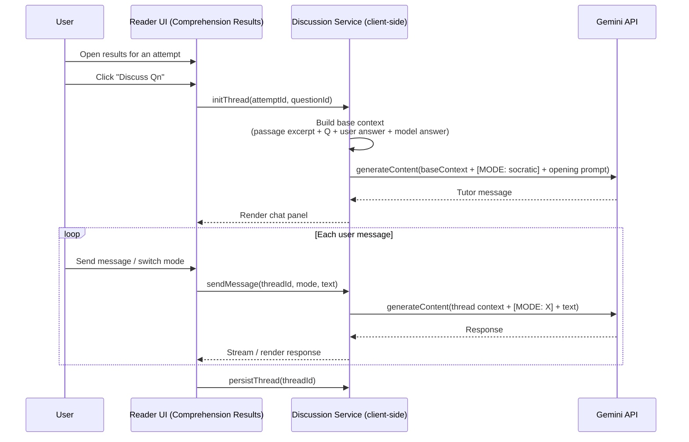
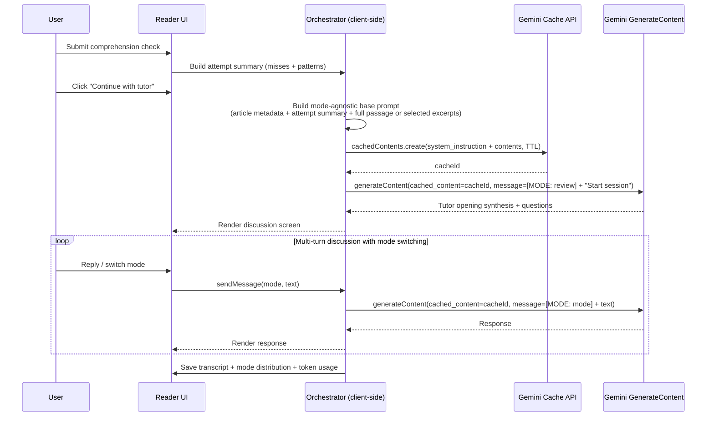

# Integrating KnOS Discussion Modes into Reader’s Comprehension-Check Extensions

## Executive Summary

Knowledge-OS (KnOS) and Reader already share a core educational thesis: durable comprehension comes from *active* engagement with text, not passive consumption. KnOS operationalizes this via multi-modal, seminar-style dialogue (Socratic, Clarify, Challenge, Teach, Quiz, Technical, Review) with explicit prompt modularity and a caching strategy designed around constraints in the Gemini context-caching model (a fixed cached “base” prompt and per-turn mode injection). Reader operationalizes the thesis via a structured comprehension-check workflow (quick-check and exam modes, closed-book → open-book sequencing, rubric-based scoring, and persistent attempt history).

The highest-leverage integration is to treat KnOS modes as a **post-check “discussion and remediation layer”** that is tightly scoped to *a passage + the user’s answers + model feedback*, rather than as a completely separate feature. This preserves Reader’s crisp assessment loop while adding an evidence-based “closing loop” to fix misconceptions and consolidate mental models.

Three viable product/architecture integration options emerge:

- **Embedded per-question discussion in Results** (“Discuss this question”): lowest UX disruption, moderate engineering, strong targeted remediation.
- **Post-comprehension continuation into a guided KnOS session** (“Continue with tutor”): best pedagogical coherence, moderate UX change, moderate-to-high engineering depending on caching/token strategy.
- **Launcher-level KnOS discussion activity** (new activity alongside Comprehension Check): broadest scope, highest product surface area, higher risk of feature sprawl.

From an engineering standpoint, the dominant design constraint is **LLM orchestration cost/latency**: a multi-turn discussion that repeatedly re-sends the full passage will be slow and expensive. Gemini’s **explicit context caching** is specifically intended for “substantial initial context referenced repeatedly by shorter requests,” with TTL and usage metadata support, and minimum token thresholds that vary by model. citeturn2search0turn2search1 This aligns strongly with KnOS’s design: cache a mode-agnostic base context once, inject mode instructions per turn, and keep per-turn payload small.

Security/privacy constraints are manageable and already partially addressed in Reader: the Gemini API key is sent via header (`x-goog-api-key`) and Electron builds can store keys in OS-backed secure storage. The official Gemini API reference explicitly documents header-based key usage. citeturn0search0 Electron’s official security checklist also provides concrete requirements (context isolation, sandboxing, IPC validation) that become more important as you add richer LLM-driven surfaces. citeturn0search4

Unstated assumptions that materially affect design choices are treated as **unspecified** (examples: target platforms beyond current web/Electron build, user scale, telemetry policy, LLM providers other than Gemini, and acceptable latency/cost budgets).

## KnOS methodology and discussion modes

### Dialogue-first pedagogy as a product primitive

KnOS frames learning as a loop: **Read → Discuss with tutor → (optionally) generate drill cards**, emphasizing articulation and seminar-style inquiry over “answer delivery.” This is implemented as an LLM tutor that behaves as a collaborator grounded in the provided text, rather than an oracle.

The architecture expresses this pedagogy through **prompt modularity** and **mode switching**:

- A **mode-agnostic base prompt** defines shared principles (“text is the authority,” “press for precision,” “open with substance,” etc.) and instructs the model to adapt when a `[MODE: …]` tag appears.
- Each discussion mode is a **separate prompt template** that defines response pattern and constraints.
- Mode is injected into conversation **without rebuilding the cached system prompt**, which matters because (as KnOS also notes) cached content usage constrains the use of system instructions (practically: you want the cached prefix stable and the mode variable). This aligns with how Gemini explicit caching is designed (cached content is a prefix reused across calls). citeturn2search0turn2search1

### KnOS modes, features, and prompt/data model patterns

KnOS’s mode list is explicit in its reader prompt loader:

```python
# knos/reader/prompts.py
MODES = ["socratic", "clarify", "challenge", "teach", "quiz", "technical", "review"]
```

Key traits of the prompt system (from `knos/reader/prompts.py` and markdown templates):

- Prompt templates are stored as markdown and rendered via **Jinja2** (`render_prompt(...)`), enabling parameterization (e.g., book/chapter titles, prior session summaries).
- The base prompt instructs: “The user's current dialogue mode will be specified at the start of each message in a `[MODE: ...]` tag.” (from `knos/reader/prompts/base.md` as fetched via the GitHub connector).
- The Socratic template defines an “opening question” and a “response pattern” (engage substance → ask focused questions → return to text).
- Clarify is direct explanation with a gentle check question.
- Challenge is devil’s advocate/stress-test.
- Teach flips roles (user explains; tutor is “confused student”).
- Quiz is rapid-fire retrieval practice.
- Technical is step-by-step guidance through formal/procedural content.
- Review synthesizes across prior sessions and transcripts.

### KnOS LLM orchestration and caching strategy

KnOS implements a provider abstraction with a **GeminiProvider** that can:

- **Create a cache** (system prompt + chapter content or PDF bytes) with TTL and a minimum-size heuristic.
- **Chat with or without cached content**, and report token usage including cached token counts.

This is a direct match for Gemini’s recommended explicit caching use cases: repeated queries against a large fixed context with short requests. citeturn2search0turn2search1

A practical constraint: when using cached content, system prompts and tool config changes are constrained; this has been a recurring theme in SDK usage discussions. citeturn0search5 KnOS’s “cache base prompt; inject mode into messages” approach is a robust workaround that generalizes well to Reader.

### KnOS persistence/data model

KnOS sessions are local, append-only transcripts (JSONL) plus metadata files. The `Session` dataclass includes:

- `exchange_count`, `mode_distribution`
- cumulative token accounting (`total_input_tokens`, `total_output_tokens`, `cache_tokens`)
- support for special session types (`review`, `quiz` sessions with unique prefixes)

This model matters for Reader integration chiefly because **Review mode depends on transcript aggregation** (cross-session synthesis). If Reader wants KnOS Review semantics, it needs an equivalent “discussion history” store, not only “attempt history.”

## Reader comprehension-check architecture and extension points

### Current comprehension-check flows

Reader supports comprehension checks in two entry contexts:

1. **Launcher entry**: Home → “Comprehension Check” → choose an article → the check runs immediately (without requiring the reading UI).
2. **Post-reading entry**: After paced reading reaches end-of-text, a “Comprehension Check” action transitions into the check and, on close, returns to the reader surface.

This is visible in `src/components/App.tsx` (end-of-text button and `handleStartComprehensionFromReading`), and in `src/lib/appViewSelectors.ts` (content-browser selection for the comprehension-check activity routes directly to `active-comprehension`).

Representative snippet:

```tsx
// src/lib/appViewSelectors.ts
if (activity === 'comprehension-check') {
  return {
    screen: 'active-comprehension',
    article,
    entryPoint: 'launcher',
    comprehension: {
      runMode: 'quick-check',
      sourceArticleIds: [article.id],
    },
  };
}
```

### Comprehension check UI and logic

The core UI is `src/components/ComprehensionCheck.tsx`, which:

- Generates questions on load:
  - quick-check: `adapter.generateCheck(article.content, questionCount)`
  - exam: `adapter.generateExam({ selectedArticles, preset, difficultyTarget, ... })`
- Runs a **closed-book → open-book** sequence:
  - quick-check: “factual” questions first (passage hidden), then other dimensions with passage available
  - exam mode: recall section closed-book, other sections open-book, with an option to disable open-book synthesis
- Scores:
  - multiple choice: auto-scored
  - true/false: requires choice + ≤2-sentence explanation; scoring uses both parts (with strict rule: wrong truth value → score 0)
  - short-answer/essay and true/false explanation: scored by the adapter via the LLM, with concurrency cap.

The prompt layer for generation and scoring is in:

- `src/lib/comprehensionPrompts.ts` for single-passage checks
- `src/lib/comprehensionExamPrompts.ts` for multi-source exams (including strong validation/invariants for blueprint structure)

### LLM adapter, schema enforcement, and transport

Reader currently uses a Gemini REST adapter (`GeminiComprehensionAdapter` in `src/lib/comprehensionAdapter.ts`) that:

- Calls `.../models/{model}:generateContent`
- Sends the API key via **`x-goog-api-key` header**
- Uses JSON schema structured output fields in `generationConfig`:
  - `responseMimeType: 'application/json'`
  - `responseJsonSchema` (when provided)

The Gemini API reference explicitly supports API key usage via `x-goog-api-key` header in REST calls. citeturn0search0

### Local persistence and settings

Reader is local-first:

- Attempts are stored in local storage (`speedread_comprehension_attempts`) with validation and a cap (`MAX_COMPREHENSION_ATTEMPTS`).
- Settings store the selected Gemini model and multiple behavior settings.
- API keys:
  - Web builds: stored in browser storage
  - Electron builds: preferred path uses OS-backed secure storage exposed via a preload bridge (`window.secureKeys`), falling back to local storage if unavailable.

Electron security guidance becomes relevant here: adding richer LLM features increases the importance of renderer isolation, sandboxing, strict IPC boundaries, and avoiding exposing powerful APIs to untrusted content. citeturn0search4

## Mapping KnOS modes to Reader integration options

### How KnOS modes map conceptually onto Reader comprehension artifacts

Reader comprehension checks produce structured artifacts: questions, user answers, scores, and feedback. KnOS modes are best understood as different **discussion operators** over these artifacts, plus the passage text. A practical mapping:

- **Socratic**: guided inquiry about reasoning behind an answer; push user to cite passage evidence.
- **Clarify**: direct explanation of why the correct answer is correct (and why the user’s answer failed), using the passage.
- **Challenge**: stress-test the user’s justification; ask counterexamples; detect fragile understanding.
- **Teach**: force the user to explain the passage’s key claim or the rationale of a correct answer as if teaching a novice.
- **Quiz**: short follow-up retrieval practice targeted to misses (micro-questions).
- **Technical**: step-by-step unpacking of a dense paragraph, formal argument, or definition.
- **Review**: cross-attempt synthesis (“patterns in missed dimensions,” “recurring misconceptions”) and planning next study actions.

### Integration options comparison table

| option | user flow | dev effort | UX impact | data changes | risk | recommended use cases |
|---|---|---:|---|---|---|---|
| Embedded per-question discussion | Results → “Discuss Q3” → chat panel scoped to (passage excerpt + question + user answer + model answer) | Medium (3–6 person-weeks) | Moderate (adds a new panel inside an existing surface) | Add “discussion thread” linked to question result; optional transcript storage | Medium (scope creep manageable; main risk is token cost if uncached) | Targeted remediation, “why was I wrong,” short sessions |
| Post-check continuation session | Submit → Results summary → “Continue with tutor” → multi-turn guided session (starts in Review or Clarify; user can switch modes) | Medium–High (5–9 person-weeks) | Higher (introduces a new post-check step and a new “session” concept) | Add new session model keyed by attempt; store mode distribution + transcript | Medium–High (requires good orchestration + termination UX) | Deep learning loops, synthesis, sustained improvement across attempts |
| Launcher-level KnOS activity | Home → “Discussion (KnOS)” → select article (or prior attempt) → discussion UI | High (7–12 person-weeks) | High (new primary activity; navigation + concept load) | New activity type; session persistence; maybe library integration | High (product sprawl; unclear boundaries vs existing reading/exercise flows) | Power users, seminar-style reading without scoring, long-form study |

### Sequence diagrams

#### Embedded per-question discussion within results



#### Post-check continuation into a guided KnOS session



## Implementation requirements

### UI/UX changes

A robust integration should make KnOS modes feel like **intentional tools**, not hidden settings. Concrete UI patterns that match both systems’ design language:

- **Mode switcher**: a compact “mode chip” row or dropdown (Socratic/Clarify/Challenge/Teach/Quiz/Technical/Review).
  - For desktop/Electron: add a shortcut analogous to KnOS `Ctrl+M` (Reader already supports keyboard-driven workflows in multiple places).
- **Context visibility controls**:
  - For embedded per-question discussion: show *only the relevant passage excerpt* by default, with an affordance to expand to the full passage (borrow the existing “Show passage” `<details>` pattern in comprehension check).
  - For post-check continuation: start from attempt summary + missed questions, and allow “expand to full text” explicitly (consent/latency).
- **Clear entry/exit semantics**:
  - “Discuss Qn” should feel like a modal/side-panel that can be dismissed without losing the results page.
  - “Continue with tutor” should be a new screen with a session summary on exit (“what we covered,” “next steps”).

### Backend/service changes

Reader is currently client-only; integration can remain client-only, but you will want to formalize a discussion layer analogous to `ComprehensionAdapter`:

- `DiscussionAdapter` interface:
  - `initThread(context): Promise<OpeningMessage>`
  - `sendMessage(threadId, mode, userText): Promise<AssistantMessage>`
  - optional: `createCache(context): Promise<cacheId>`
  - `closeThread(threadId): void`

Key orchestration decision: **adopt explicit context caching for multi-turn sessions**.

Gemini explicit caching supports caching large context once and reusing it for multiple follow-up requests, with TTL and usage metadata and minimum token thresholds depending on model. citeturn2search0turn2search1 This is precisely what a KnOS-style discussion needs.

Security note: Gemini REST calls should continue to use the `x-goog-api-key` header (not query params), per the official API reference. citeturn0search0

### Data model migrations or integrations

To support KnOS-like Review mode and durable discussion history, Reader needs a **discussion transcript model**. A minimal viable model:

- `DiscussionSession`
  - `id`
  - `scope`: `{ type: 'attempt' | 'question' | 'article', attemptId?, questionId?, articleId }`
  - `createdAt`, `lastUpdatedAt`
  - `modeDistribution: Record<Mode, number>`
  - `messages: Array<{ role: 'user'|'assistant', mode?: Mode, content: string, createdAt, tokenUsage? }>`
  - `llmConfig`: `{ provider: 'gemini', model, caching: { enabled, cacheId?, ttlSec? } }`
  - `promptPack`: `{ id, version }`

Storage changes:

- Add a new storage key (e.g., `speedread_discussion_sessions`) and bump `CURRENT_STORAGE_SCHEMA_VERSION`.
- Keep attempt history and discussion history separate, linking by IDs. This avoids bloating the attempt object and simplifies migrations.

### Prompt/policy/versioning strategy

KnOS’s biggest transferable idea is **prompt modularity with per-turn mode injection**. In Reader terms:

- Define a **base prompt** (mode-agnostic) that:
  - explains ground rules (“use only passage evidence,” “be a study partner,” “avoid generic praise,” etc.)
  - explains that the user will send messages prefixed with `[MODE: X]` and that the assistant must not echo the tag
- Define a prompt file per mode (as in KnOS markdown templates). This can be implemented as:
  - static string constants in TS, or
  - markdown files loaded at build time.

Versioning:

- Assign semantic versions, e.g., `knos-discussion-pack@1.0.0`.
- Persist `promptPack` metadata on each discussion session. When prompts change, old sessions remain interpretable and debuggable.

Policy:

- Reuse Reader comprehension constraints: “Use only evidence from the passage. Do not use outside knowledge.”
- Add explicit privacy/consent language before sending text to the LLM:
  - “This will send the selected passage (or excerpt) and your responses to the Gemini API.”

### LLM orchestration and cost/latency implications

The cost/latency model is driven by **(a) number of calls** and **(b) per-call tokens**.

Current Reader comprehension checks already do:

- 1 generation call for questions
- N scoring calls for free-response (up to concurrency 2 in code)

Adding a discussion layer can add dozens of calls in a heavy session. Without caching, each call risks re-sending the full passage and transcript. With explicit caching:

- You pay a one-time “cache creation” call and then send short per-turn deltas.
- Gemini documentation explicitly positions caching for repeated reuse of substantial initial context, with TTL and usage metadata to observe cached token hits. citeturn2search0turn2search1

Practical orchestration strategy (recommended):

- **Embedded per-question discussion**:
  - Prefer excerpt-level context (question-specific paragraph(s) + model answer).
  - Skip caching unless excerpt exceeds minimum thresholds; rely on small context windows.
- **Post-check continuation**:
  - Use explicit caching when sending full passage + attempt summary.
  - Keep the cached base prompt mode-agnostic; inject mode each turn (KnOS pattern).
  - Allow mode-specific model selection only if you forego caching, or if you use a caching scheme keyed to model/system prompt stability.

Important constraints to acknowledge:

- Minimum token thresholds for caching vary by model; Gemini docs provide minimums and note that cached content is a prompt prefix. citeturn2search0turn2search1
- API pricing and model availability are temporally unstable; treat exact costs as unspecified and derive budgets from measured usage metadata.

### Security/privacy and consent considerations

Key areas:

- **API key handling**
  - Continue using `x-goog-api-key` header as the Gemini REST reference documents. citeturn0search0
  - Avoid any implementation that places keys in URLs (these may be logged or surfaced in error traces; the risk is widely observed in practice).
- **Electron attack surface**
  - Adding a conversational agent increases the amount of potentially sensitive user text processed and displayed. If Reader is shipped as an Electron app, adhere to Electron’s official security checklist (context isolation, sandboxing, restrictive CSP, IPC sender validation, etc.). citeturn0search4
- **Consent UX**
  - Add a clear control: “Send full passage” vs “Send excerpt only.”
  - Add a redaction option for URLs/emails/numbers if user content may be sensitive (unspecified requirement; but low-cost and high-trust).
- **Local-only storage**
  - Discussions and attempts should remain local by default, consistent with current Reader posture.
  - If future telemetry is added, consent must be explicit (unspecified).

## Testing, evaluation, rollout plan, and effort estimates

### Testing and evaluation plan

Testing should cover deterministic surfaces (parsing, routing, persistence) and probabilistic surfaces (LLM variability).

Deterministic test layers:

- **Unit tests**
  - Mode injection formatting: ensure `[MODE: X]` prefix is applied consistently and never leaked into UI.
  - Prompt pack versioning: ensure older sessions retain their prompt pack metadata.
  - Storage migrations: schema upgrade/downgrade behavior; “no data loss” invariants.
- **Integration tests (mocked LLM)**
  - Discussion sessions can run end-to-end with a fake adapter returning canned responses.
  - Verify correct linking from attempts/questions to discussion sessions.

Probabilistic evaluation layers:

- **Metrics**
  - Adoption: percent of attempts with any discussion follow-up.
  - Completion: average follow-up message count, time in session.
  - Learning proxy: improvement in subsequent attempt scores on same article or same group (if groups exist).
  - Error remediation: fraction of “needs review” questions that have a follow-up discussion and subsequent improvement.
- **A/B tests (local-first compatible)**
  - Embedded discussion button shown vs hidden.
  - Default mode after results: Clarify vs Review vs Socratic.
  - Excerpt-only vs full-passage context default (measure latency + engagement).
- **Quality audits**
  - Human spot checks on whether the tutor stays passage-grounded and whether Challenge mode avoids strawman objections.

### Rollout and migration plan with milestones

A pragmatic phased rollout (ordered by risk reduction and reusability):

Milestone A: discussion primitives (foundation)
- Implement `DiscussionAdapter` (Gemini generateContent) reusing existing key storage and model selection.
- Implement a simple chat UI component with message list + input + mode switcher.
- Persist discussions in local storage (new key + schema bump).
- Add “Discuss this question” on results page, excerpt-scoped only.

Milestone B: post-check continuation
- Add “Continue with tutor” on results summary.
- Build attempt summarizer prompt (“top misconceptions,” “weak dimensions,” “suggested next steps”) that seeds the first tutor message.
- Add session exit summary (what covered, next action pointers).

Milestone C: caching optimization for long sessions
- Add explicit caching path for post-check continuation sessions when using full passage or multi-source exam contexts.
- Track and display usage metadata (cached vs non-cached tokens) in a developer/debug panel, to support cost tuning. citeturn2search0turn2search1

Milestone D: Review mode parity
- Add cross-attempt synthesis: enable Review mode to pull multiple attempts for the same article (and, optionally, same group).
- Provide “patterns across attempts” reporting.

### Developer effort estimates

Rough estimates in **person-weeks** (one experienced engineer familiar with the codebase; excludes major UX re-design or external user studies):

- **Embedded per-question discussion**: 3–6 person-weeks
  - UI panel + mode switcher + persistence + basic prompting
  - No caching in v1 (excerpt-only)
- **Post-check continuation session**: +2–4 person-weeks on top
  - attempt summarization + new screen + better session lifecycle
- **Explicit caching integration (Gemini)**: +1–3 person-weeks
  - implement cache create/list/delete path and integrate into adapter
  - add usage metadata tracking and fallback behavior

### Recommended next steps and prioritized implementation roadmap

Immediate next steps (highest leverage, lowest regret):

1. **Define the “discussion scope contract”**
   - Decide: excerpt-only by default vs full passage by default (recommend excerpt-only initially for latency and privacy).
2. **Implement embedded per-question discussion (Option: Embedded per-question discussion)**
   - Fastest path to meaningful value, minimal disruption, strong fit with Reader’s remediation workflow.
3. **Add prompt pack structure mirroring KnOS**
   - Base prompt + seven mode prompts, versioned and persisted on each session.
4. **Measure token usage and latency**
   - Before building caching, instrument current discussion usage with approximate token estimation and request timing.
5. **Add explicit caching for the post-check continuation path**
   - Build on Gemini explicit caching semantics (TTL, usage metadata, minimum thresholds) to keep multi-turn sessions performant. citeturn2search0turn2search1
6. **Security hardening review for Electron**
   - Re-audit preload exposures and IPC boundaries under Electron’s security checklist guidance. citeturn0search4

Reference pointers for maintainers (repo file locations used heavily in this analysis; included as code since raw clickable citations were not reliably retrievable via the web tool):

```text
Knowledge-OS
- knos/reader/prompts.py
- knos/reader/prompts/*.md (base.md, socratic.md, clarify.md, challenge.md, teach.md, quiz.md, technical.md, review.md)
- knos/reader/screens/dialogue.py
- knos/reader/llm.py
- knos/reader/session.py

Reader
- src/components/App.tsx
- src/components/ComprehensionCheck.tsx
- src/lib/comprehensionAdapter.ts
- src/lib/comprehensionPrompts.ts
- src/lib/comprehensionExamPrompts.ts
- src/lib/storage.ts
- src/lib/appViewSelectors.ts
- electron/preload.ts
- shared/electron-contract.ts
```

External primary sources used for architecture constraints and security posture:

- Gemini API REST authentication and request structure (header-based `x-goog-api-key`). citeturn0search0
- Gemini explicit context caching concepts, TTL, cost/speed rationale, minimum token thresholds, and usage metadata signals. citeturn2search0turn2search1
- Electron official security checklist for renderer isolation/sandboxing/IPC hygiene. citeturn0search4